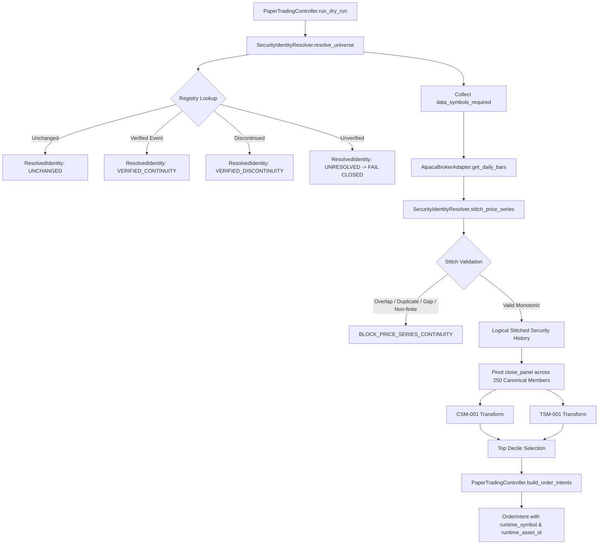

# Identity Resolver Architecture & Call Graph

## 1. Execution Flow Diagram

## 2. Module Responsibilities
- `engine.security_identity_resolver.SecurityIdentityResolver`: General deterministic resolution engine.
- `engine.paper_trading_controller.PaperTradingController`: Production controller coordinating resolution, data ingestion, alpha transformation, and safety checks.
